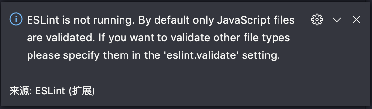
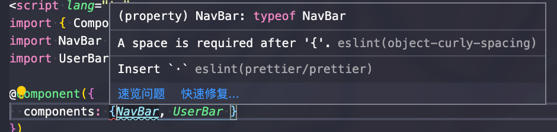
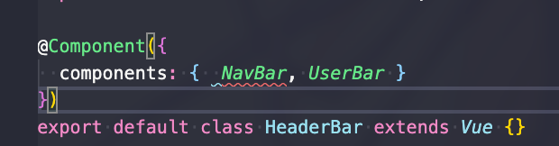
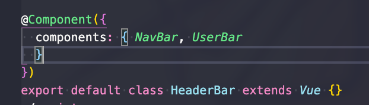

- 项目：vue+typescript+eslint+prettier

- 环境：vscode

- 坑：eslint 保存无法自动格式化 vue 文件及 ts 文件

- 解决方案：配置 `settings.json` 文件

## 初始化项目

最近使用 vue cli3 开始了一个新项目。不得不说 vue cli3 初始化项目比之前方便了不少，配置也精简了许多。

因为之前一直使用 eslint+prettier 作为格式化工具，表现也十分不错，所以这次一样使用了这对黄金搭档~

vue cli3 在初始化时一共提供了五个 lint 选项：

```javascript
  ESLint with error prevention only
  ESLint + Airbnb config
  ESLint + Standard config
❯ ESLint + Prettier
  TSLint (deprecated)
```

这里还是推荐 eslint+prettier 吧，可以更好地自定义规则，虽然 airbnb 也十分不错。顺带一提，tslint 官方已经打算废弃 tslint 投奔 eslint 怀抱了，不过 tslint 的语法检查以及格式化功能确实还是 eslint 好用，所以。。

## 配置 eslint 与 prettier

配置这块也很简单，初始化的项目里就有了 `.eslintrc.js` 文件，只要在里面的 `rules` 属性里填上自己的规则就行。prettier 的配置则需要自己再根目录新建一个 `prettier.config.js` 文件，在 `module.exports = {}` 中写入规则就行。

然后就是在`settings.json` 文件中配置 eslint 保存时自动格式化，这个一直都是开启的所以我就没去检查（当然这个选项仍是开启的）。当然如果没安装 vscode 的两个插件得先装一下。

## 坑的表象

接下来就是令人费解的现象了。

按了 cmd+S，一模一样的 lint 配置，在其他 js 项目中正常运行，在这里却无法自动格式化。而 alt+shift+F 的 prettier 格式化却能正常工作，并且应用的规则确实为我项目中配置的，但这并不能满足我的格式化需求。

**更关键的是，代码中不规范的地方并没有被 eslint 标红。**

## 定位问题

这个时候问题已经很明显了，eslint 并没有在 ts 文件中被启用。

并且当我 F1 执行 `ESlint: Fix all auto-fixable Problems` 的时候，vscode 给出了这样的警告：



问题在于 `settings.json` 中没有对 vue 文件及 ts 文件开启 eslint 验证，接下来只要设置好配置文件就行了。

## 解决方案

在 `settings.json` 配置文件中（建议在工作区中配置）添加：

```javascript
{
    // ... other config
    "eslint.validate": [
        "javascript",
        "javascriptreact",
        "vue",
        "typescript",
        "typescriptreact"
    ]
}
```

这样确实能开启 eslint 的验证，但是无法启用格式化，需要把配置改为：

```javascript
{
    // ... other config
    "eslint.validate": [
        "javascript",
        "javascriptreact",
        {
            "language": "vue",
            "autoFix": true
        },
        {
            "language": "typescript",
            "autoFix": true
        },
        {
            "language": "typescriptreact",
            "autoFix": true
        }
    ],
}
```

因为 eslint 默认启用对 javascript 语言的格式化，所以不需要单独配置。

## 关于 eslint 与 prettier 配置的冲突

### 冲突

对于相同的代码，部分 eslint 与 prettier 规则验证会同时生效，导致重复格式化，比如：



cmd+S 保存之后：



因为 eslint 和 prettier 的格式化功能同时生效了。这个时候就需要再次保存，把多余的空格删除。遇到其他复杂情况甚至需要多次保存。

显然这样操作太过繁琐。。

prettier 一直都以”武断“著称，其提供的配置也是少得可怜，而且同一配置会在不同地方发挥作用，所以去修改 prettier 的配置并不是明智的选择。

虽然可以像这样在 eslint 的 `rules` 中配置忽略部分 prettier 的功能：

```javascript
// ... other config
rules: {
    // ... other rules
    "prettier/prettier": {
      bracketSpacing: false
    }
}
```

但是其结果会导致类似这样的情况无法被格式化：



所以可取的方法只有忽略 eslint 中与 prettier 功能相同的规则。

幸运的是，已经有人替我们做了这些工作。

### 配置

可以通过 `eslint-config-prettier` 配置，关闭 eslint 中与 prettier 冲突的选项，这样同一个地方就不会再看到两个 error 或 warn。配置也十分简单：

```javascript
// .eslintrc.js
{
  extends: [
    // ...
    "prettier",
  ],
}
```

不过使用 vue cli3 初始化项目时选择了 eslint+prettier lint 选项时，vue 会自动安装好 `@vue/eslint-config-prettier` 等插件，并自动配置好：

```javascript
// .eslintrc.js
{
  extends: [
    "plugin:vue/essential",
    "@vue/prettier",
    "@vue/typescript"
  ],
}
```

`@vue/eslint-config-prettier` 内部已经帮我们处理了 prettier 与 eslint 以及 eslint-plugin-vue 插件之间的冲突。

```javascript
// @vue/eslint-config-prettier
module.exports = {
  plugins: ["prettier"],
  extends: [
    "eslint:recommended",
    require.resolve("eslint-config-prettier"),
    require.resolve("eslint-config-prettier/vue")
  ],
  rules: {
    "prettier/prettier": "warn"
  }
};
```

`@vue/eslint-config-typescript` 也差不多，帮我们进行了简单配置，顺便提示我们可以使用 `@typescript-eslint/...` 这样的形式修改规则。不过该插件必须同 eslint-plugin-vue 一并使用。

```javascript
// @vue/eslint-config-typescript
module.exports = {
  plugins: ["@typescript-eslint"],
  // Prerequisite `eslint-plugin-vue`, being extended, sets
  // root property `parser` to `'vue-eslint-parser'`, which, for code parsing,
  // in turn delegates to the parser, specified in `parserOptions.parser`:
  // https://github.com/vuejs/eslint-plugin-vue#what-is-the-use-the-latest-vue-eslint-parser-error
  parserOptions: {
    parser: require.resolve("@typescript-eslint/parser")
  },
  rules: {
    // https://typescript-eslint.io/parser
    "no-undef": "off",
    "no-unused-vars": "off",
    // https://github.com/typescript-eslint/typescript-eslint/issues/46
    // '@typescript-eslint/no-unused-vars': 'error',

    // temporary fix for https://github.com/vuejs/vue-cli/issues/1922
    // very strange as somehow this rule gets different behaviors depending
    // on the presence of @typescript-eslint/parser...
    strict: "off"
  }
};
```

### 最后

如果使用 vue cli3 初始化 vue 项目，建议 lint 选项选择 eslint+prettier，这样可以省掉一些配置的时间，需要其他 standard 或 airbnb 也可以自行安装。对于有官方提供 vue 版本的插件（如 `@vue/eslint-config-prettier` ），建议直接使用 vue 官方插件，可以节省很多处理冲突时间。
